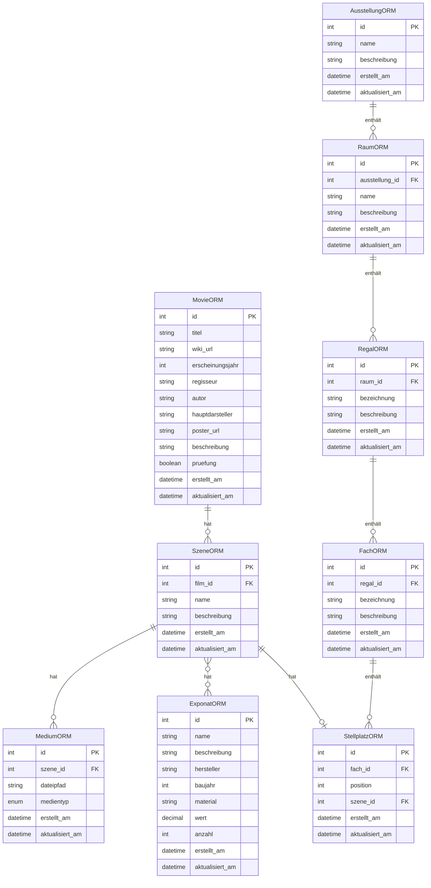

# Datenbankstruktur - ER-Diagramm (Mermaid)

Dieses Dokument stellt die Struktur der Datenbank des Museum-Projekts in Form eines Entity-Relationship-Diagramms dar, erstellt mit Mermaid.

## ER-Diagramm

## Hinweise zur Darstellung

- Die Pfeile zeigen die Beziehungen zwischen den Entitäten an:
  - `||--o{` bedeutet eine 1:n-Beziehung (ein Objekt hat viele andere Objekte)
  - `}o--o{` bedeutet eine m:n-Beziehung (viele zu vielen)
  - `||--o|` bedeutet eine 1:1-Beziehung (ein Objekt hat genau ein anderes Objekt)

- PK = Primärschlüssel
- FK = Fremdschlüssel

## Verwendung

Dieses Diagramm kann in Markdown-Viewern angezeigt werden, die Mermaid unterstützen, wie z.B. GitHub, GitLab oder VS Code mit entsprechenden Erweiterungen.