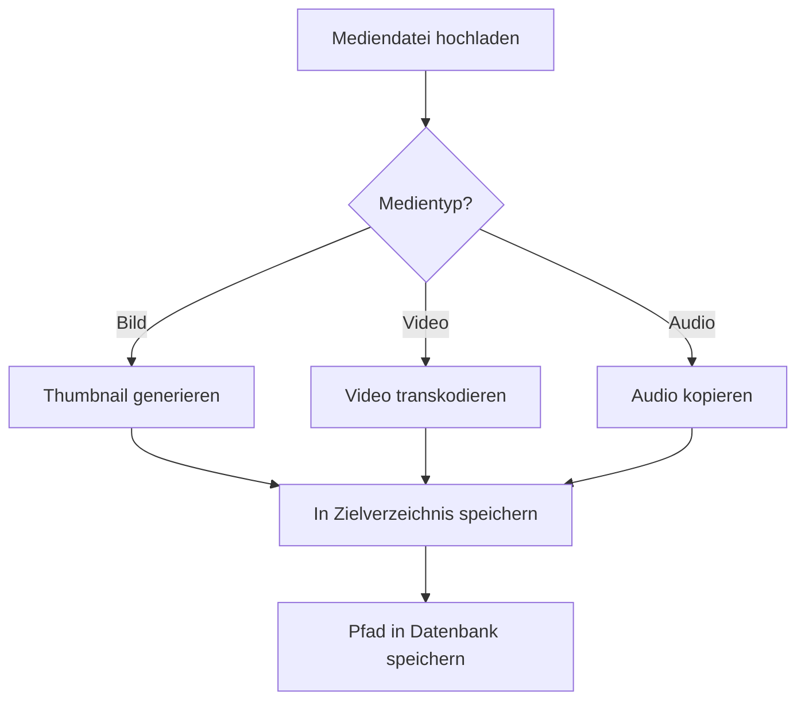

# Medienverarbeitung im Museum-Projekt

## Übersicht

Die Medienverarbeitung ist eine wichtige Komponente des Museum-Projekts, die für die Verarbeitung von Bildern, Videos und Audiodateien zuständig ist. Diese Dokumentation erklärt den Prozess im Detail.



## Komponenten der Medienverarbeitung

### 1. Thumbnail-Generierung für Bilder

Die Funktion `generate_image_thumbnail` erstellt Thumbnails für Bilder mit Hilfe der Pillow-Bibliothek.

```python
def generate_image_thumbnail(movie_id: int, filename: str, size=(200, 200)) -> Path:
    """
    Erzeugt ein Thumbnail für ein Bild:
    1. Quelle: BASE/images/movies/{movie_id}/{filename}
    2. Ziel: BASE/images/movies/{movie_id}/thumbs/{filename}
    """
    src = BASE / "images" / "movies" / str(movie_id) / filename

    # Prüfen, ob die Quelldatei existiert
    if not src.exists():
        raise FileNotFoundError(f"Quelldatei nicht gefunden: {src}")

    dest_dir = BASE / "images" / "movies" / str(movie_id) / "thumbs"
    dest_dir.mkdir(parents=True, exist_ok=True)

    thumb_path = dest_dir / filename
    with Image.open(src) as img:
        img.thumbnail(size)
        img.save(thumb_path, format=img.format)
    return thumb_path
```

### 2. Video-Transkodierung

Die Funktion `transcode_video` transkodiert Videos in verschiedene Auflösungen mit Hilfe von ffmpeg.

```python
def transcode_video(movie_id: int, filename: str, resolution="720p") -> Path:
    """
    Transkodiert ein Video mit ffmpeg:
    1. Quelle: BASE/videos/movies/{movie_id}/{filename}
    2. Ziel: BASE/videos/movies/{movie_id}/{resolution}/{filename}
    Wenn ffmpeg fehlt oder fehlschlägt, wird die Quelldatei als Fallback kopiert.
    """
    src = BASE / "videos" / "movies" / str(movie_id) / filename

    # Prüfen, ob die Quelldatei existiert
    if not src.exists():
        raise FileNotFoundError(f"Quelldatei nicht gefunden: {src}")

    # Auflösungszuordnung
    res_map = {"720p": "1280:720", "480p": "854:480"}
    size = res_map.get(resolution, res_map["480p"])

    dest_dir = BASE / "videos" / "movies" / str(movie_id) / resolution
    dest_dir.mkdir(parents=True, exist_ok=True)

    dest = dest_dir / filename
    cmd = [
        "ffmpeg",
        "-i", str(src),
        "-vf", f"scale={size}",
        "-c:a", "copy",
        str(dest)
    ]

    try:
        subprocess.run(cmd, check=True)
    except Exception as e:
        logger.warning(f"Transkodierung fehlgeschlagen ({e!r}), kopiere Original als Fallback")
        shutil.copy2(src, dest)
    return dest
```

### 3. Szenen-Medienverarbeitung

Die Funktion `process_scene_media` verarbeitet Mediendateien für Szenen, je nach Medientyp.

```python
def process_scene_media(szene_id: int, film_id: int, dateipfad: str, medientyp: Literal["audio", "video"]) -> Path:
    """
    Verarbeitet Mediendateien für Szenen:
    1. Für Audio: Kopiert die Datei in das entsprechende Verzeichnis
    2. Für Video: Transkodiert das Video mit ffmpeg
    """
    src = Path(dateipfad)

    # Prüfen, ob die Quelldatei existiert
    if not src.exists():
        raise FileNotFoundError(f"Quelldatei nicht gefunden: {src}")

    filename = src.name

    if medientyp == "audio":
        dest_dir = BASE / "audio" / "movies" / str(film_id) / str(szene_id)
        dest_dir.mkdir(parents=True, exist_ok=True)

        dest = dest_dir / filename
        shutil.copy2(src, dest)
        return dest
    elif medientyp == "video":
        # Für Videos verwenden wir die bestehende transcode_video-Funktion
        # Zuerst in das Quellverzeichnis kopieren
        temp_dir = BASE / "videos" / "movies" / str(film_id)
        temp_dir.mkdir(parents=True, exist_ok=True)

        temp_path = temp_dir / filename
        shutil.copy2(src, temp_path)

        # Dann transkodieren
        transcoded = transcode_video(film_id, filename)

        # Ein szenenspezifisches Verzeichnis erstellen und die transkodierte Datei dorthin kopieren
        scene_dir = BASE / "videos" / "movies" / str(film_id) / str(szene_id)
        scene_dir.mkdir(parents=True, exist_ok=True)

        final_path = scene_dir / filename
        shutil.copy2(transcoded, final_path)

        return final_path
    else:
        raise ValueError(f"Nicht unterstützter Medientyp: {medientyp}")
```

### 4. API-Endpunkt für Medienverarbeitung

Der Endpunkt `/media/process/{movie_id}` löst die Medienverarbeitung für einen Film aus.

```python
@media_router.post("/process/{movie_id}")
async def process_media(
    movie_id: int,
    background_tasks: BackgroundTasks,
    db_session: Session = Depends(get_db)
):
    """
    Verarbeitet alle Medien für einen Film:
    1. Generiert Thumbnails für alle Bilder
    2. Transkodiert Videos in verschiedene Auflösungen
    """
    # Prüfen, ob der Film existiert
    movie = db_session.query(MovieORM).filter(MovieORM.id == movie_id).first()
    if not movie:
        raise HTTPException(status_code=404, detail="Film nicht gefunden")

    # Hintergrundtask für die Verarbeitung starten
    background_tasks.add_task(process_all_media_for_movie, movie_id)

    return {"status": "Medienverarbeitung gestartet"}
```

## Ablauf der Medienverarbeitung

1. **Mediendatei hochladen**: Der Prozess beginnt mit dem Hochladen einer Mediendatei (Bild, Video, Audio).

2. **Medientyp bestimmen**: Je nach Medientyp wird eine unterschiedliche Verarbeitung durchgeführt:
   - **Bilder**: Thumbnails werden generiert
   - **Videos**: Videos werden in verschiedene Auflösungen transkodiert
   - **Audio**: Audiodateien werden kopiert

3. **Verarbeitung durchführen**:
   - Für Bilder: Die Pillow-Bibliothek wird verwendet, um Thumbnails zu erstellen
   - Für Videos: ffmpeg wird verwendet, um Videos zu transkodieren
   - Für Audio: Die Dateien werden einfach kopiert

4. **In Zielverzeichnis speichern**: Die verarbeiteten Dateien werden in die entsprechenden Verzeichnisse gespeichert:
   - Bilder: `BASE/images/movies/{movie_id}/thumbs/{filename}`
   - Videos: `BASE/videos/movies/{movie_id}/{resolution}/{filename}`
   - Audio: `BASE/audio/movies/{film_id}/{szene_id}/{filename}`

5. **Pfad in Datenbank speichern**: Die Pfade zu den Mediendateien werden in der Datenbank gespeichert, um später darauf zugreifen zu können.

## Verzeichnisstruktur für Medien

Die Medienverarbeitung verwendet eine bestimmte Verzeichnisstruktur, um die Dateien zu organisieren:

```
BASE/
├── images/
│   └── movies/
│       └── {movie_id}/
│           ├── {filename}
│           └── thumbs/
│               └── {filename}
├── videos/
│   └── movies/
│       └── {movie_id}/
│           ├── {filename}
│           ├── 720p/
│           │   └── {filename}
│           ├── 480p/
│           │   └── {filename}
│           └── {szene_id}/
│               └── {filename}
└── audio/
    └── movies/
        └── {movie_id}/
            └── {szene_id}/
                └── {filename}
```

## Konfiguration der Medienverarbeitung

Die Medienverarbeitung kann über die folgenden Einstellungen in der `.env`-Datei konfiguriert werden:

```
APP_MEDIA_STATIC_PATH=/app/static
APP_MEDIA_URL=/media
FEATURE_THUMBNAILS=true
```

- **APP_MEDIA_STATIC_PATH**: Pfad im Container zum Ordner mit Bildern, Videos, Audio
- **APP_MEDIA_URL**: URL-Präfix für Mediendateien
- **FEATURE_THUMBNAILS**: Thumbnail-Pipeline ein-/ausschalten

## Unterstützte Formate

### Bilder
- JPEG (.jpg, .jpeg)
- PNG (.png)
- GIF (.gif)

### Videos
- MP4 (.mp4)
- WebM (.webm)
- AVI (.avi)

### Audio
- MP3 (.mp3)
- WAV (.wav)
- OGG (.ogg)

## Tipps und Best Practices

1. **Dateiformate**: Verwenden Sie standardisierte Dateiformate (JPEG, PNG für Bilder; MP4 für Videos; MP3 für Audio).

2. **Dateigrößen**: Achten Sie auf angemessene Dateigrößen, um die Verarbeitung zu beschleunigen.

3. **ffmpeg-Installation**: Stellen Sie sicher, dass ffmpeg im Container installiert ist, um die Videoverarbeitung zu ermöglichen.

4. **Fehlerbehandlung**: Die Medienverarbeitung enthält Fallback-Mechanismen, falls die Verarbeitung fehlschlägt.

5. **Speicherplatz**: Überwachen Sie den verfügbaren Speicherplatz, da die Medienverarbeitung viel Speicherplatz benötigen kann.

6. **Parallelisierung**: Die Medienverarbeitung läuft im Hintergrund, um die Benutzeroberfläche nicht zu blockieren.