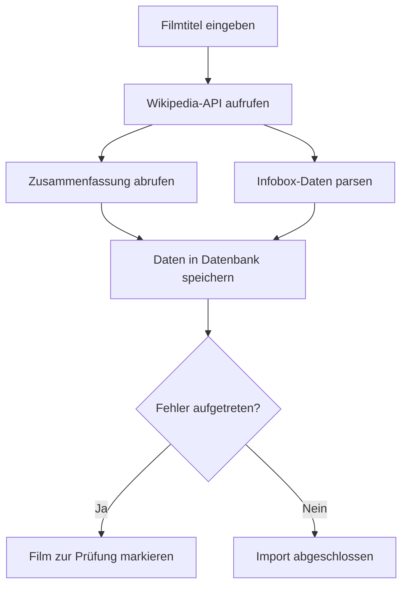

# Wiki-Import-Prozess im Museum-Projekt

## Übersicht

Der Wiki-Import ist eine zentrale Funktion des Museum-Projekts, die es ermöglicht, Filmdaten automatisch aus Wikipedia und Wikidata zu importieren. Diese Dokumentation erklärt den Prozess im Detail.



## Komponenten des Wiki-Imports

### 1. WikiImporter-Klasse

Die `WikiImporter`-Klasse ist der zentrale Dienst für den Import von Filmdaten aus Wikipedia und Wikidata.

```python
class WikiImporter:
    @staticmethod
    def fetch(title: str) -> Dict[str, str]:
        # 1) Sprache für Wikipedia aus Settings setzen
        wikipedia.set_lang(settings.wikipedia_language)
        
        # 2) Kurzzusammenfassung über die Wikipedia-Bibliothek
        summary = wikipedia.page(title).summary

        # 3) Infobox-Daten über wptools parsen
        page = wptools.page(title, lang=settings.wikipedia_language).get_parse()
        infobox = page.data.get("infobox", {})

        # 4) Relevante Felder herausziehen
        director   = infobox.get("Regie")     or infobox.get("regie")     or infobox.get("director")
        author     = infobox.get("Drehbuch")  or infobox.get("drehbuch")  or infobox.get("writer")
        main_cast  = infobox.get("Besetzung") or infobox.get("besetzung") or infobox.get("starring")
        poster_url = infobox.get("Bild")      or infobox.get("bild")      or infobox.get("image")    or infobox.get("poster")

        return {
            "beschreibung":    summary,
            "regisseur":       director,
            "autor":           author,
            "hauptdarsteller": main_cast,
            "poster_url":      poster_url,
        }
```

### 2. Einzelner Film-Import

Der Einzelimport wird über den `/movies/import/{movie_id}` Endpunkt ausgelöst und aktualisiert die Metadaten eines vorhandenen Films.

```python
@movie_router.post("/import/{movie_id}")
def import_movie_metadata(
    movie_id: int,
    db_session: Session = Depends(get_db),
):
    # Film aus DB laden
    film = db_session.query(MovieORM).filter(
        MovieORM.id == movie_id
    ).first()
    if not film:
        raise HTTPException(status_code=404)

    try:
        # WikiImporter aufrufen
        data = WikiImporter.fetch(film.titel)
        
        # Nur leere Felder überschreiben
        for key, value in data.items():
            if getattr(film, key, None) in (None, "", []):
                setattr(film, key, value)
                
        db_session.commit()
        return film
        
    except Exception as e:
        # Bei Fehlern Film zur manuellen Review markieren
        film.pruefung = True
        db_session.commit()
        raise HTTPException(status_code=502)
```

### 3. Bulk-Import mehrerer Filme

Der Bulk-Import ermöglicht das Importieren mehrerer Filme im Hintergrund und wird über den `/wiki/import` Endpunkt ausgelöst.

```python
@wiki_router.post("/import")
def import_from_wiki(
    request: WikiImportRequest,
    background_tasks: BackgroundTasks,
    db_session: Session = Depends(get_db),
):
    # Status-Reset
    import_status = {
        "status": "running", 
        "processed": 0, 
        "errors": 0
    }

    def import_titles(titles: List[str], session: Session):
        for title in titles:
            try:
                # Nur neu anlegen, wenn nicht vorhanden
                existing = session.query(MovieORM).filter_by(
                    titel=title
                ).first()
                if not existing:
                    movie = MovieORM(titel=title)
                    session.add(movie)
                    session.commit()

                    # WikiImporter aufrufen
                    data = WikiImporter.fetch(title)
                    for key, value in data.items():
                        setattr(movie, key, value)
                    session.commit()

                import_status["processed"] += 1

            except Exception as e:
                import_status["errors"] += 1

        import_status["status"] = "completed"

    # Task zur Abarbeitung einreihen
    background_tasks.add_task(
        import_titles, request.titles, session=db_session
    )
```

## Ablauf des Wiki-Imports

1. **Filmtitel identifizieren**: Der Prozess beginnt mit einem Filmtitel, der entweder aus der Datenbank geladen oder vom Benutzer eingegeben wird.

2. **Wikipedia-API aufrufen**: Die `wikipedia`-Bibliothek wird verwendet, um die Zusammenfassung des Films abzurufen. Die Sprache wird aus den Anwendungseinstellungen übernommen.

3. **Infobox-Daten parsen**: Die `wptools`-Bibliothek wird verwendet, um die strukturierten Daten aus der Wikipedia-Infobox zu extrahieren. Diese enthält Informationen wie Regisseur, Autor, Hauptdarsteller und Poster-URL.

4. **Daten in Datenbank speichern**: Die extrahierten Daten werden in die Datenbank importiert. Beim Einzelimport werden nur leere Felder überschrieben, um vorhandene Daten nicht zu überschreiben.

5. **Fehlerbehandlung**: Bei Fehlern während des Imports wird der Film zur manuellen Prüfung markiert (`pruefung=True`).

## Konfiguration des Wiki-Imports

Der Wiki-Import kann über die folgenden Einstellungen in der `.env`-Datei konfiguriert werden:

```
APP_WIKIPEDIA_LANGUAGE=de
APP_WIKIPEDIA_API_URL=https://de.wikipedia.org/w/api.php
```

- **APP_WIKIPEDIA_LANGUAGE**: Legt die Sprache für Wikipedia-Abfragen fest (z.B. "de" für Deutsch, "en" für Englisch)
- **APP_WIKIPEDIA_API_URL**: Basis-URL für die Wikipedia-API

## Tipps und Best Practices

1. **Filmtitel präzisieren**: Verwenden Sie möglichst genaue Filmtitel, um die richtigen Daten zu erhalten. Bei Mehrdeutigkeiten fügen Sie z.B. "(Film)" hinzu.

2. **Fehlerbehandlung**: Prüfen Sie regelmäßig Filme mit `pruefung=True`, da diese manuell überprüft werden müssen.

3. **Bulk-Import begrenzen**: Importieren Sie nicht zu viele Filme auf einmal, um die Wikipedia-API nicht zu überlasten.

4. **Caching**: Bei wiederholten Importen desselben Films werden die Daten aus der Datenbank verwendet, um unnötige API-Aufrufe zu vermeiden.

5. **Spracheinstellungen**: Stellen Sie sicher, dass die richtige Sprache für Ihre Zielgruppe eingestellt ist.